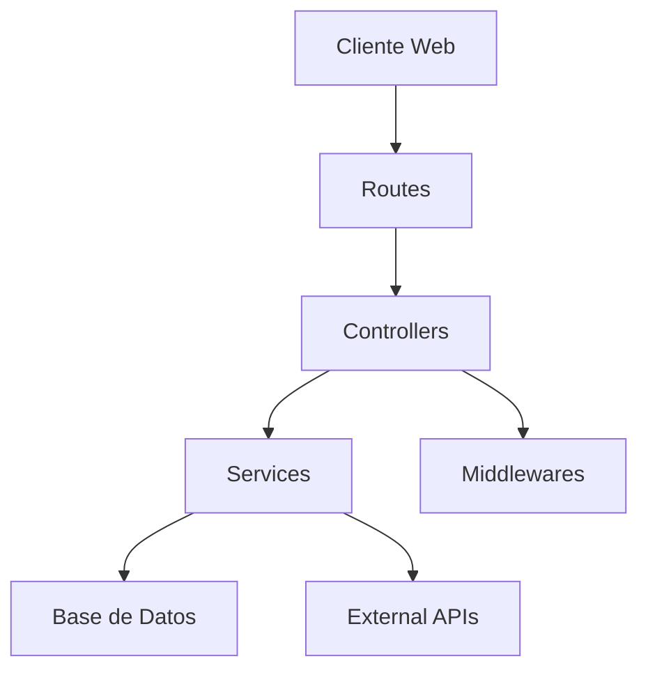

# RazoConnect 

Sistema integral de E-commerce y gestión de inventario diseñado para optimizar operaciones comerciales B2B.

## Características Principales

- Sistema de autenticación multi-rol (Clientes, Agentes, Administradores)
- Catálogo de productos con gestión de variantes y paquetes
- Sistema de carrito de compras y pedidos
- Gestión de créditos y cuentas por pagar
- Panel administrativo completo
- Sistema de notificaciones en tiempo real
- Reportes y estadísticas
- Gestión de comisiones para agentes

## Tecnologías

- **Backend:** Node.js con Express
- **Base de Datos:** PostgreSQL
- **Frontend:** HTML5, JavaScript Vanilla, Bootstrap 5
- **Autenticación:** JWT, Passport (Google OAuth)
- **Email:** Nodemailer
- **Procesamiento de Pagos:** MercadoPago
- **Tareas Programadas:** node-cron

## Arquitectura del Proyecto

Controllers

| Archivo | Responsabilidad Específica |
|---------|---------------------------|
| `adminController.js` | Gestión completa del panel administrativo: CRUD de productos, gestión de inventario, aprobación de cambios y monitoreo de operaciones. |
| `agentesController.js` | Control de agentes de venta: gestión de cartera, cálculo de comisiones y métricas de rendimiento. |
| `authController.js` | Autenticación completa: login tradicional, OAuth con Google, manejo de JWT y roles de acceso. |
| `carritoController.js` | Lógica del carrito: agregar/quitar productos, validar stock, aplicar descuentos y procesar checkout. |
| `creditoController.js` | Gestión de créditos: límites, saldos, historial y validación de operaciones crediticias. |
| `cxpController.js` | Control de cuentas por pagar: registro de facturas, pagos y seguimiento de vencimientos. |
| `inventarioController.js` | Control de inventario: entradas, salidas, ajustes y validación de stock. |
| `pedidosController.js` | Procesamiento de pedidos: creación, seguimiento, backorder y actualización de estados. |
| `productosController.js` | Gestión de productos: CRUD, variantes, precios y categorización. |
| `reportesController.js` | Generación de reportes: ventas, inventario, comisiones y estados financieros. |

Routes

| Archivo | Responsabilidad Específica |
|---------|---------------------------|
| `admin.js` | Rutas protegidas del panel admin: `/api/admin/*` con validación de roles. |
| `auth.js` | Endpoints de autenticación: login, registro, refresh token y OAuth. |
| `carrito.js` | Rutas de carrito: gestión de productos y proceso de compra. |
| `clientes.js` | API de clientes: perfil, direcciones y preferencias. |
| `pagos.js` | Integración con MercadoPago y gestión de transacciones. |
| `pedidos.js` | Gestión de órdenes: creación, seguimiento y actualizaciones. |
| `productos.js` | API de productos: catálogo, búsqueda y filtrado. |
| `staff.js` | Rutas específicas para personal interno y agentes. |

Services

| Archivo | Responsabilidad Específica |
|---------|---------------------------|
| `ChangeRequestService.js` | Control de cambios y aprobaciones en sistema. |
| `auditService.js` | Registro de auditoría de operaciones críticas. |
| `emailService.js` | Envío de correos transaccionales y notificaciones. |
| `inventoryService.js` | Lógica de negocio para gestión de inventario. |
| `notificacionesService.js` | Sistema de notificaciones en tiempo real. |
| `ordenesService.js` | Procesamiento y seguimiento de órdenes de compra. |

Middleware

| Archivo | Responsabilidad Específica |
|---------|---------------------------|
| `authMiddleware.js` | Validación de JWT y roles de usuario. |
| `checkClienteCredit.js` | Validación de límites de crédito en operaciones. |
| `checkCreditStatus.js` | Verificación de estado crediticio activo. |
| `notificaciones.js` | Middleware de notificaciones en tiempo real. |
| `upload.js` | Gestión de carga de archivos y validación. |

Public/Components

| Archivo | Responsabilidad Específica |
|---------|---------------------------|
| `header-cliente.html` | Navbar principal con carrito y notificaciones. |
| `admin-header.html` | Header del panel administrativo con menú de gestión. |
| `sidebar-filtros.html` | Filtros de catálogo: categorías, precios, marcas. |
| `footer.html` | Footer común con enlaces y copyright. |

Public/JS

| Archivo | Responsabilidad Específica |
|---------|---------------------------|
| `api.js` | Cliente API para comunicación con backend. |
| `carritoService.js` | Gestión del carrito en el frontend. |
| `jwt-utils.js` | Manejo de tokens JWT en cliente. |
| `theme-manager.js` | Control de temas estacionales. |
| `admin-*.js` | Scripts específicos del panel admin. |
| `agente-*.js` | Funcionalidad del portal de agentes. |

Public/Pages

| Vista | Funcionalidad |
|-------|---------------|
| `catalogo.html` | Listado de productos con filtros. |
| `producto-detalle.html` | Vista detallada de producto con variantes. |
| `carrito.html` | Carrito de compras y checkout. |
| `admin-*.html` | Vistas del panel administrativo. |
| `agente-*.html` | Portal de agentes de venta. |

### Flujo de Datos y Dependencias

### Patrones de Diseño

1. **MVC Modificado**
   - Routes: Enrutamiento y validación inicial
   - Controllers: Lógica de negocio
   - Services: Capa de abstracción para operaciones complejas

2. **Middleware Pipeline**
   - Autenticación
   - Validación de roles
   - Verificación de crédito
   - Logging y auditoría

3. **Component-Based Frontend**
   - Componentes reutilizables
   - Inyección dinámica vía loaders
   - Gestión de estado con localStorage

### Rutas Principales

#### API Routes

| Ruta | Descripción |
|------|-------------|
| `/api/auth` | Autenticación y registro |
| `/api/productos` | Gestión de productos y catálogo |
| `/api/carrito` | Operaciones del carrito de compras |
| `/api/pedidos` | Gestión de pedidos |
| `/api/admin` | Panel administrativo |
| `/api/cliente` | Operaciones de clientes |
| `/api/staff` | Gestión de personal |
| `/api/pagos` | Procesamiento de pagos |

#### Frontend Pages

| Ruta | Archivo | Descripción |
|------|---------|-------------|
| `/` | `index.html` | Página principal/catálogo |
| `/admin` | `admin-*.html` | Panel administrativo |
| `/agente` | `agente-*.html` | Portal de agentes |
| `/producto` | `producto-detalle.html` | Detalles de producto |
| `/carrito` | `carrito.html` | Carrito de compras |
| `/cuenta` | `cuenta-*.html` | Gestión de cuenta de usuario |

## Seguridad

- Autenticación JWT para API
- Middleware de autorización por roles
- Validación de datos en endpoints
- Sanitización de entradas
- Control de acceso basado en roles (RBAC)
- Protección contra CSRF

## Componentes Reutilizables

El sistema utiliza componentes HTML modulares ubicados en `/public/components/`:
- Header Cliente (`header-cliente.html`)
- Header Admin/Staff (`admin-header.html`)
- Sidebar Filtros (`sidebar-filtros.html`)
- Footer común (`footer.html`)

## Diseño y Estilo

- Tema principal con `--razo-orange` (#F97316)
- Diseño responsivo con Bootstrap 5
- Componentes consistentes con bordes redondeados y sombras suaves
- Modales estandarizados para formularios administrativos

## Mantenimiento

- Sistema de logs para comunicaciones
- Tareas de mantenimiento diario automatizadas
- Respaldos periódicos de base de datos
- Monitoreo de rendimiento y salud del sistema

## Licencia

Este proyecto está bajo la Licencia ISC. Ver el archivo `LICENSE` para más detalles.
