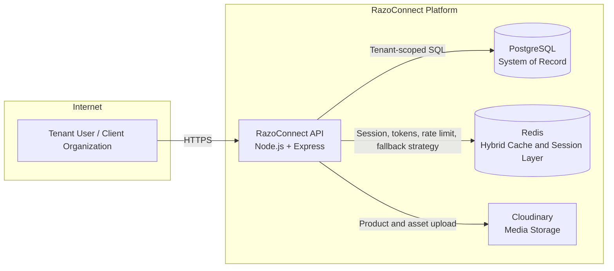

# RazoConnect

Enterprise-grade B2B SaaS platform for multi-tenant commerce, inventory, finance, and operations workflows.

## Table of Contents

1. [Executive Summary](#executive-summary)
2. [Product Scope and Personas](#product-scope-and-personas)
3. [System Architecture](#system-architecture)
4. [Multi-tenancy and Data Isolation](#multi-tenancy-and-data-isolation)
5. [Security and Compliance](#security-and-compliance)
6. [RBAC and Access Governance](#rbac-and-access-governance)
7. [Core Business Flows](#core-business-flows)
8. [API and Integration Contracts](#api-and-integration-contracts)
9. [Operations and SRE](#operations-and-sre)
10. [Deployment Environments](#deployment-environments)
11. [Testing and Quality Gates](#testing-and-quality-gates)
12. [Documentation Map by Audience](#documentation-map-by-audience)
13. [Changelog and ADRs](#changelog-and-adrs)
14. [Contribution Standards](#contribution-standards)
15. [Ownership and Review Cadence](#ownership-and-review-cadence)
16. [License](#license)

## Executive Summary

RazoConnect is a single-platform, multi-tenant SaaS solution that supports B2B commerce operations end to end:

- Catalog and order management
- Inventory allocation and reconciliation
- Credit and collections workflows
- Agent commissions and operational controls

Design goal: one platform serving multiple business tenants with strict data isolation and role-based operational governance.

## Product Scope and Personas

Primary capabilities:

- Sales and order lifecycle
- Warehouse and finance confirmation flows
- Backorder and FIFO allocation
- Credit/CxC operations
- Purchase and inventory audit workflows

Primary personas:

- Platform owner and super admin
- Tenant admin
- Finance and operations teams
- Inventory and purchasing teams
- Sales agents
- End customers

## System Architecture

RazoConnect follows a layered architecture on Node.js and Express, with PostgreSQL as the system of record and Redis for distributed caching/session patterns.

### C4 Context Diagram (Mermaid)

Deep architecture details are maintained in [docs/MULTITENANCY.md](docs/MULTITENANCY.md).

## Multi-tenancy and Data Isolation

Isolation model:

- Shared application instance
- Shared PostgreSQL schema
- Row-level tenant partitioning through tenant_id
- Domain-driven tenant resolution in request processing

Enforcement model:

- Tenant context resolved at middleware level
- Queries and business operations constrained by tenant context
- Cross-tenant access checks for authenticated users

Reference documentation:

- [docs/MULTITENANCY.md](docs/MULTITENANCY.md)
- [docs/COMPLETE_ADMIN_SEPARATION.md](docs/COMPLETE_ADMIN_SEPARATION.md)

## Security and Compliance

Security posture (high level):

- Secure transport and hardened headers
- Token-based authentication with session controls
- Input validation and defensive middleware layers
- Tenant isolation and role-scoped access controls

Current canonical security implementation notes are in:

- [docs/SECURITY_AUDIT.md](docs/SECURITY_AUDIT.md)

Legal/proprietary notice is in:

- [docs/SECURITY.md](docs/SECURITY.md)

## RBAC and Access Governance

The platform uses role-based governance with operational specialization (admin, finance, inventory, purchasing, agent, and related roles).

Role reference:

- [docs/SYSTEM_ROLES.md](docs/SYSTEM_ROLES.md)
- [docs/FINANCE_WAREHOUSE.md](docs/FINANCE_WAREHOUSE.md)

## Core Business Flows

Key enterprise flows:

- Order preparation and finance confirmation
- FIFO-based allocation and backorder recalculation
- Purchase order consolidation by supplier
- Inventory reconciliation and monthly audit
- Cancellation with cascade handling and traceability

Reference documents:

- [docs/FINANCE_WAREHOUSE.md](docs/FINANCE_WAREHOUSE.md)
- [docs/FIFO_CASOS_DE_USO.md](docs/FIFO_CASOS_DE_USO.md)
- [docs/BACKORDER_CONSOLIDATION_IMPLEMENTATION.md](docs/BACKORDER_CONSOLIDATION_IMPLEMENTATION.md)
- [docs/AUDITORIA_MENSUAL_INVENTARIO.md](docs/AUDITORIA_MENSUAL_INVENTARIO.md)
- [docs/CANCELACION_PEDIDOS_BACKORDERS.md](docs/CANCELACION_PEDIDOS_BACKORDERS.md)

## API and Integration Contracts

The system exposes REST endpoints for admin, operational, and customer domains.

Current state:

- API behavior is documented in module-specific docs
- OpenAPI/Swagger standardization is planned for centralized API contracts

Starting points:

- [docs/ARCHITECTURE_AUDIT.md](docs/ARCHITECTURE_AUDIT.md)
- [docs/FUNCTIONAL_GUIDE.md](docs/FUNCTIONAL_GUIDE.md)

## Operations and SRE

Operational concerns covered in documentation:

- Deployment troubleshooting and rollback guidance
- Maintenance routines
- Health monitoring endpoints and checks
- Redis fallback behavior in development and production contexts

Operational references:

- [docs/DEPLOYMENT_AND_TROUBLESHOOTING.md](docs/DEPLOYMENT_AND_TROUBLESHOOTING.md)
- [docs/MAINTENANCE_CHECKLIST.md](docs/MAINTENANCE_CHECKLIST.md)
- [docs/REDIS_SMART_FALLBACK.md](docs/REDIS_SMART_FALLBACK.md)

## Deployment Environments

Production profile:

- Azure App Service
- Azure Database for PostgreSQL
- Redis-compatible session/cache strategy
- Cloudinary for media assets

Container and local setup references:

- [docs/DOCKER_SETUP.md](docs/DOCKER_SETUP.md)
- [docs/DOCKER_DEPLOYMENT.md](docs/DOCKER_DEPLOYMENT.md)

## Testing and Quality Gates

Quality strategy includes:

- Unit and integration test suites
- Redis fallback validation suites
- Domain-specific regression tests for inventory and workflow safety

Execution baseline:

- npm test
- npm run test:coverage

Testing references:

- [docs/TESTING_REDIS_FALLBACK.md](docs/TESTING_REDIS_FALLBACK.md)
- [tests/redis/README.md](tests/redis/README.md)

## Documentation Map by Audience

Use this map to jump to the right documentation quickly.

| Audience | Read First | Then Deep Dive |
|---|---|---|
| Finance and Operations | [docs/FINANCE_WAREHOUSE.md](docs/FINANCE_WAREHOUSE.md) | [docs/FUNCTIONAL_GUIDE.md](docs/FUNCTIONAL_GUIDE.md), [docs/SISTEMA_6_ESTADOS.md](docs/SISTEMA_6_ESTADOS.md) |
| Inventory and Purchasing | [docs/INVENTORY_MODEL_OVERVIEW.md](docs/INVENTORY_MODEL_OVERVIEW.md) | [docs/FIFO_CASOS_DE_USO.md](docs/FIFO_CASOS_DE_USO.md), [docs/BACKORDER_CONSOLIDATION_IMPLEMENTATION.md](docs/BACKORDER_CONSOLIDATION_IMPLEMENTATION.md), [docs/AUDITORIA_MENSUAL_INVENTARIO.md](docs/AUDITORIA_MENSUAL_INVENTARIO.md) |
| DevOps and Platform | [docs/DEPLOYMENT_AND_TROUBLESHOOTING.md](docs/DEPLOYMENT_AND_TROUBLESHOOTING.md) | [docs/DOCKER_DEPLOYMENT.md](docs/DOCKER_DEPLOYMENT.md), [docs/MAINTENANCE_CHECKLIST.md](docs/MAINTENANCE_CHECKLIST.md), [docs/REDIS_SMART_FALLBACK.md](docs/REDIS_SMART_FALLBACK.md) |
| Security Auditors | [docs/SECURITY_AUDIT.md](docs/SECURITY_AUDIT.md) | [docs/MULTITENANCY.md](docs/MULTITENANCY.md), [docs/COMPLETE_ADMIN_SEPARATION.md](docs/COMPLETE_ADMIN_SEPARATION.md), [docs/SECURITY.md](docs/SECURITY.md) |
| Backend Engineers | [docs/MULTITENANCY.md](docs/MULTITENANCY.md) | [docs/ARCHITECTURE_AUDIT.md](docs/ARCHITECTURE_AUDIT.md), [docs/CONCILIACION_INVENTARIO_REFACTOR.md](docs/CONCILIACION_INVENTARIO_REFACTOR.md), [docs/INVENTORY_INTEGRITY_FIX.md](docs/INVENTORY_INTEGRITY_FIX.md) |
| Product and Business Stakeholders | [docs/FUNCTIONAL_GUIDE.md](docs/FUNCTIONAL_GUIDE.md) | [docs/FINANCE_WAREHOUSE.md](docs/FINANCE_WAREHOUSE.md), [docs/PRIORITY_SYSTEM_USER_GUIDE.md](docs/PRIORITY_SYSTEM_USER_GUIDE.md), [docs/RMA_SYSTEM.md](docs/RMA_SYSTEM.md) |
| New Developers and Onboarding | [docs/LEARNING_ROUTE.md](docs/LEARNING_ROUTE.md) | [docs/MULTITENANCY.md](docs/MULTITENANCY.md), [docs/FUNCTIONAL_GUIDE.md](docs/FUNCTIONAL_GUIDE.md) |

## Changelog and ADRs

Recent implementation notes and change histories are distributed in docs files prefixed by CHANGELOG or implementation summaries.

Examples:

- [docs/CHANGELOG_FINANCE_WAREHOUSE.md](docs/CHANGELOG_FINANCE_WAREHOUSE.md)
- [docs/CHANGELOG_REDIS_SMART_FALLBACK.md](docs/CHANGELOG_REDIS_SMART_FALLBACK.md)

## Contribution Standards

Baseline standards:

- Follow repository linting, testing, and PR review requirements
- Keep architecture decisions and flow changes documented in docs
- Prefer module-level documentation updates over README-level technical expansion

Developer workflow references:

- [docs/ARCHITECTURE_AUDIT.md](docs/ARCHITECTURE_AUDIT.md)
- [docs/LEARNING_ROUTE.md](docs/LEARNING_ROUTE.md)

## Ownership and Review Cadence

Recommended governance model:

- README master map review: monthly
- Security and architecture review: monthly or after critical change
- Operational runbook review: before and after major deployments
- Functional workflow review: each release affecting finance, warehouse, or inventory

This README is intentionally high-level. Detailed implementation, SQL examples, and troubleshooting depth live under docs.

## License

Proprietary software. See [docs/SECURITY.md](docs/SECURITY.md) for legal terms and restrictions.
