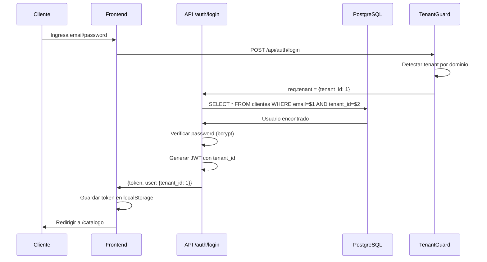
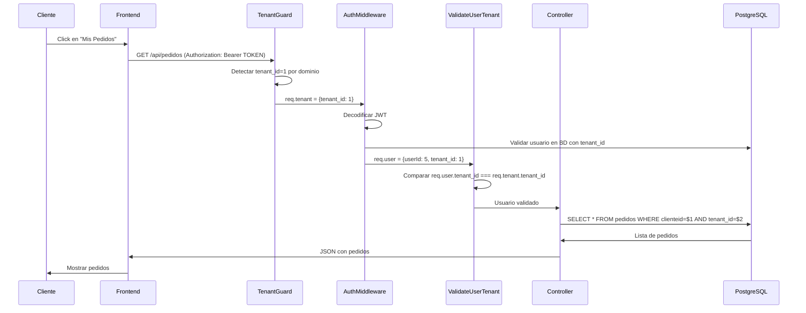
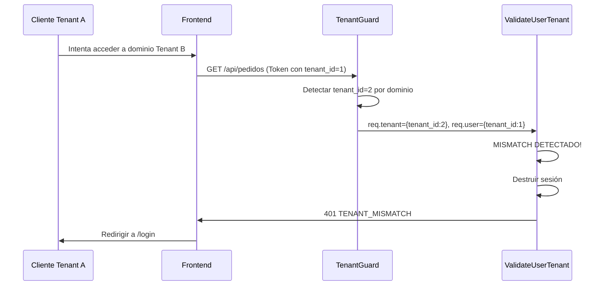

# Arquitectura del Sistema Multi-Tenant

## Tabla de Contenidos

1. [Stack Tecnológico](#stack-tecnológico)
2. [Arquitectura Multi-Tenant](#arquitectura-multi-tenant)
3. [Modelo de Datos](#modelo-de-datos)
4. [Seguridad y Aislamiento](#seguridad-y-aislamiento)
5. [Flujo de Autenticación](#flujo-de-autenticación)
6. [Middleware Pipeline](#middleware-pipeline)
7. [Gestión de Sesiones](#gestión-de-sesiones)
8. [Diagrama de Arquitectura](#diagrama-de-arquitectura)

## Stack Tecnológico

### Backend
- **Runtime**: Node.js v18+
- **Framework**: Express.js 4.18.2
- **Base de Datos**: PostgreSQL v17+ (Azure Database for PostgreSQL)
- **ORM/Query**: pg (node-postgres) - Queries SQL directas
- **Autenticación**: JWT (jsonwebtoken) + Passport.js
- **Sesiones**: express-session + connect-pg-simple (persistencia en PostgreSQL)

### Frontend
- **Lenguaje**: JavaScript Vanilla (ES6+)
- **Framework CSS**: Bootstrap 5
- **Arquitectura**: Component-Based con inyección dinámica
- **Gestión de Estado**: localStorage + Session Storage

### Infraestructura
- **Hosting**: Azure App Service
- **Base de Datos**: Azure Database for PostgreSQL
- **CDN de Imágenes**: Cloudinary
- **CI/CD**: GitHub Actions
- **Email**: Nodemailer (SMTP)
- **Pagos**: MercadoPago SDK

### Dependencias Principales

```json
{
  "express": "^4.18.2",
  "pg": "^8.11.3",
  "express-session": "^1.17.3",
  "connect-pg-simple": "^10.0.0",
  "jsonwebtoken": "^9.0.2",
  "passport": "^0.7.0",
  "bcrypt": "^5.1.1",
  "cloudinary": "^1.41.3",
  "node-cron": "^4.2.1",
  "exceljs": "^4.4.0"
}
```

## Arquitectura Multi-Tenant

### Concepto Fundamental

RazoConnect implementa un modelo **Multi-Tenant con Base de Datos Compartida y Aislamiento por Columna** (Shared Database, Shared Schema). Esto significa:

- Una única instancia de la aplicación sirve a múltiples clientes (tenants)
- Una única base de datos PostgreSQL contiene datos de todos los tenants
- El aislamiento se logra mediante la columna `tenant_id` en cada tabla
- Cada tenant tiene su propio dominio personalizado (ej: `razo.com.mx`, `fashion.com.mx`)

### Ventajas del Modelo Implementado

1. **Eficiencia de Recursos**: Un solo servidor y base de datos para todos los clientes
2. **Mantenimiento Simplificado**: Actualizaciones y parches se aplican una sola vez
3. **Escalabilidad Horizontal**: Fácil agregar nuevos tenants sin infraestructura adicional
4. **Costos Reducidos**: Menor overhead operativo comparado con bases de datos separadas

### Tabla Central: `tenants`

```sql
CREATE TABLE tenants (
    tenant_id SERIAL PRIMARY KEY,
    nombre_cliente VARCHAR(255) NOT NULL,
    dominio VARCHAR(255) UNIQUE NOT NULL,
    tema VARCHAR(50) DEFAULT 'razo',
    is_active BOOLEAN DEFAULT TRUE,
    fecha_creacion TIMESTAMP DEFAULT CURRENT_TIMESTAMP
);
```

**Campos Clave:**
- `tenant_id`: Identificador único del tenant (usado en todas las tablas relacionadas)
- `dominio`: Dominio personalizado del cliente (ej: `razo.com.mx`)
- `tema`: Carpeta de vistas a usar (`razo` o `fashion`)
- `is_active`: Estado del servicio (permite suspender tenants sin eliminar datos)

### Detección de Tenant

El sistema detecta el tenant activo mediante dos métodos:

#### 1. Por Dominio (Producción)

```javascript
// middlewares/tenantGuard.js
const hostname = req.hostname; // ej: "razo.com.mx"
const normalizedDomain = normalizeDomain(hostname); // remover www., lowercase

const result = await db.query(
  `SELECT tenant_id, nombre_cliente, is_active, tema, dominio 
   FROM tenants 
   WHERE LOWER(REPLACE(dominio, 'www.', '')) = $1`,
  [normalizedDomain]
);

req.tenant = result.rows[0];
```

#### 2. Por Variable de Entorno (Desarrollo)

```javascript
// Para desarrollo local con localhost
if (process.env.FORCE_TENANT_ID) {
  const forcedTenantId = parseInt(process.env.FORCE_TENANT_ID, 10);
  const result = await db.query(
    'SELECT tenant_id, nombre_cliente, is_active, tema FROM tenants WHERE tenant_id = $1',
    [forcedTenantId]
  );
  req.tenant = result.rows[0];
}
```

**Configuración en .env:**
```env
FORCE_TENANT_ID=1  # Solo para desarrollo
```

## Modelo de Datos

### Tablas con Aislamiento por Tenant

Todas las tablas de negocio incluyen la columna `tenant_id` como Foreign Key:

```sql
-- Ejemplo: Productos
CREATE TABLE productos (
    productoid SERIAL PRIMARY KEY,
    tenant_id INTEGER NOT NULL REFERENCES tenants(tenant_id),
    nombre VARCHAR(255) NOT NULL,
    sku VARCHAR(100),
    precio NUMERIC(10,2),
    -- ... otros campos
    CONSTRAINT unique_sku_per_tenant UNIQUE (tenant_id, sku)
);

-- Ejemplo: Clientes
CREATE TABLE clientes (
    clienteid SERIAL PRIMARY KEY,
    tenant_id INTEGER NOT NULL REFERENCES tenants(tenant_id),
    nombre VARCHAR(255) NOT NULL,
    email VARCHAR(255),
    -- ... otros campos
    CONSTRAINT unique_email_per_tenant UNIQUE (tenant_id, email)
);

-- Ejemplo: Pedidos
CREATE TABLE pedidos (
    pedidoid SERIAL PRIMARY KEY,
    tenant_id INTEGER NOT NULL REFERENCES tenants(tenant_id),
    clienteid INTEGER REFERENCES clientes(clienteid),
    fecha TIMESTAMP DEFAULT CURRENT_TIMESTAMP,
    total NUMERIC(10,2),
    -- ... otros campos
);
```

### Tablas Globales (Sin tenant_id)

Algunas tablas son compartidas entre todos los tenants:

- `tenants`: Tabla maestra de clientes
- `estados`: Catálogo de estados de México (compartido)
- `developers`: Usuarios con acceso super-admin al sistema completo
- `agentesdeventas`: Agentes pueden trabajar para múltiples tenants

### Patrón de Aislamiento en Controladores

Todos los controladores implementan el siguiente patrón:

```javascript
// controllers/productosController.js
const obtenerProductos = async (req, res) => {
  try {
    // CRÍTICO: Extraer tenant_id del request
    const { tenant_id } = req.tenant;
    
    // SELECT: Filtrar por tenant_id
    const result = await db.query(
      `SELECT * FROM productos 
       WHERE tenant_id = $1 
       ORDER BY productoid DESC`,
      [tenant_id]
    );
    
    res.json(result.rows);
  } catch (error) {
    console.error('Error:', error);
    res.status(500).json({ error: 'Error al obtener productos' });
  }
};

const crearProducto = async (req, res) => {
  try {
    const { tenant_id } = req.tenant;
    const { nombre, sku, precio } = req.body;
    
    // INSERT: Incluir tenant_id
    const result = await db.query(
      `INSERT INTO productos (tenant_id, nombre, sku, precio)
       VALUES ($1, $2, $3, $4)
       RETURNING *`,
      [tenant_id, nombre, sku, precio]
    );
    
    res.json(result.rows[0]);
  } catch (error) {
    console.error('Error:', error);
    res.status(500).json({ error: 'Error al crear producto' });
  }
};

const actualizarProducto = async (req, res) => {
  try {
    const { tenant_id } = req.tenant;
    const { id } = req.params;
    const { nombre, precio } = req.body;
    
    // UPDATE: Validar tenant_id en WHERE
    const result = await db.query(
      `UPDATE productos 
       SET nombre = $1, precio = $2
       WHERE productoid = $3 AND tenant_id = $4
       RETURNING *`,
      [nombre, precio, id, tenant_id]
    );
    
    if (result.rows.length === 0) {
      return res.status(404).json({ error: 'Producto no encontrado' });
    }
    
    res.json(result.rows[0]);
  } catch (error) {
    console.error('Error:', error);
    res.status(500).json({ error: 'Error al actualizar producto' });
  }
};
```

**Reglas de Oro:**
1. **SELECT**: Siempre incluir `WHERE tenant_id = $X`
2. **INSERT**: Siempre incluir `tenant_id` en los valores
3. **UPDATE/DELETE**: Siempre incluir `AND tenant_id = $X` en el WHERE
4. **JOINS**: Validar tenant_id en todas las tablas involucradas

## Seguridad y Aislamiento

### Capas de Seguridad

El sistema implementa múltiples capas de seguridad para garantizar el aislamiento entre tenants:

#### 1. Tenant Guard Middleware

Primer nivel de seguridad que se ejecuta en TODAS las peticiones:

```javascript
// index.js - Orden de middlewares
app.use(tenantGuard);              // 1. Detectar tenant
app.use(validateUserTenant);       // 2. Validar usuario vs tenant
app.use(express.static(...));      // 3. Servir archivos estáticos
app.use('/api', routes);           // 4. Rutas de API
```

**Funciones del Tenant Guard:**
- Detectar tenant por dominio o FORCE_TENANT_ID
- Validar que el tenant existe en la base de datos
- Verificar que el tenant está activo (`is_active = true`)
- Inyectar `req.tenant` en el request
- Redirigir a `/suspended` si el tenant está inactivo
- Redirigir a `/tienda-no-encontrada` si el dominio no existe

#### 2. Validate User Tenant Middleware

Segundo nivel que valida usuarios autenticados:

```javascript
// middlewares/validateUserTenant.js
function validateUserTenant(req, res, next) {
  if (!req.user || !req.tenant) {
    return next();
  }

  const userTenantId = req.user.tenant_id;
  const requestTenantId = req.tenant.tenant_id;

  // MISMATCH: Usuario de un tenant accediendo a otro
  if (userTenantId !== requestTenantId) {
    console.log('SECURITY ALERT: Tenant mismatch detected!');
    
    // Destruir sesión y hacer logout
    req.logout((err) => {
      req.session.destroy(() => {
        res.clearCookie('razoconnect.sid');
        return res.status(401).json({
          error: 'Sesión invalidada',
          code: 'TENANT_MISMATCH'
        });
      });
    });
  } else {
    next();
  }
}
```

#### 3. Autenticación JWT con Tenant

Los tokens JWT incluyen el `tenant_id`:

```javascript
// utils/jwtHelper.js
const payload = {
  userId: user.id,
  email: user.email,
  rol: user.rol,
  tenant_id: user.tenant_id  // CRÍTICO
};

const token = jwt.sign(payload, process.env.JWT_SECRET, {
  expiresIn: '7d'
});
```

#### 4. Validación en Middleware de Autenticación

```javascript
// middlewares/authMiddleware.js
const authenticate = async (req, res, next) => {
  const decoded = verifyToken(token);
  const tenantIdFromToken = decoded?.tenant_id || req.tenant?.tenant_id;
  
  // Validar que el usuario pertenece al tenant correcto
  const result = await db.query(
    'SELECT * FROM administradores WHERE adminid = $1 AND tenant_id = $2',
    [userId, tenantIdFromToken]
  );
  
  if (!result.rows.length) {
    return res.status(401).json({ message: 'Usuario no autorizado' });
  }
  
  req.user = { ...decoded, tenant_id: result.rows[0].tenant_id };
  next();
};
```

#### 5. Aislamiento de Archivos Estáticos

Cada tenant tiene su propia carpeta de vistas:

```javascript
// index.js
app.use((req, res, next) => {
  const tenantFolder = req.tenant?.tema || 'razo';
  const tenantPath = path.join(__dirname, 'tenants_views', tenantFolder);
  
  // AISLAMIENTO TOTAL: Solo servir archivos del tenant actual
  express.static(tenantPath)(req, res, next);
});
```

**Estructura de Carpetas:**
```
tenants_views/
├── razo/
│   ├── index.html
│   ├── catalogo.html
│   ├── css/
│   └── js/
└── fashion/
    ├── index.html
    ├── catalogo.html
    ├── css/
    └── js/
```

### Roles y Permisos

El sistema maneja 4 roles principales:

#### 1. Super Admin (Developer)
- Acceso completo a todos los tenants
- Puede crear y gestionar tenants
- Acceso al panel `/developer`
- **NO tiene tenant_id** (tabla `developers`)

#### 2. Admin (Administrador de Tenant)
- Acceso completo a su tenant específico
- Gestión de productos, inventario, pedidos
- Gestión de usuarios y agentes
- **Tiene tenant_id** (tabla `administradores`)

#### 3. Agente de Ventas
- Acceso a su cartera de clientes
- Visualización de pedidos y comisiones
- **NO tiene tenant_id** (puede trabajar para múltiples tenants)
- Tabla: `agentesdeventas`

#### 4. Cliente
- Acceso a catálogo y carrito
- Gestión de pedidos propios
- **Tiene tenant_id** (tabla `clientes`)

### Matriz de Permisos

| Recurso | Super Admin | Admin | Agente | Cliente |
|---------|-------------|-------|--------|---------|
| Gestionar Tenants | ✓ | ✗ | ✗ | ✗ |
| Gestionar Productos | ✓ | ✓ | ✗ | ✗ |
| Ver Inventario | ✓ | ✓ | ✗ | ✗ |
| Gestionar Pedidos | ✓ | ✓ | Ver propios | Ver propios |
| Gestionar Clientes | ✓ | ✓ | Ver cartera | ✗ |
| Ver Reportes | ✓ | ✓ | Ver propios | ✗ |
| Realizar Compras | ✗ | ✗ | ✗ | ✓ |

## Flujo de Autenticación

### 1. Login de Cliente



### 2. Petición Autenticada



### 3. Intento de Acceso Cross-Tenant (Bloqueado)



## Middleware Pipeline

### Orden de Ejecución

```javascript
// index.js - Orden crítico de middlewares

// 1. Configuración básica
app.use(cors());
app.use(express.json());
app.use(express.urlencoded({ extended: true }));

// 2. Sesiones (ANTES de Passport)
app.use(createDynamicSessionMiddleware());

// 3. Passport (DESPUÉS de sesiones)
app.use(passport.initialize());
app.use(passport.session());

// 4. Rutas de excepción (ANTES de tenantGuard)
app.use('/developer', developerRoutes);
app.get('/suspended', ...);
app.get('/tienda-no-encontrada', ...);

// 5. Tenant Guard (CRÍTICO - detecta tenant)
app.use(tenantGuard);

// 6. Validación de tenant para usuarios autenticados
app.use(validateUserTenant);

// 7. Archivos estáticos (DESPUÉS de tenantGuard)
app.use((req, res, next) => {
  const tenantFolder = req.tenant?.tema || 'razo';
  express.static(path.join(__dirname, 'tenants_views', tenantFolder))(req, res, next);
});

// 8. Rutas de API (DESPUÉS de todo)
app.use('/api', authRoutes);
app.use('/api', productosRoutes);
// ... otras rutas
```

### Middlewares Personalizados

#### tenantGuard
- **Propósito**: Detectar y validar tenant
- **Ejecuta**: En TODAS las peticiones (excepto whitelisted)
- **Inyecta**: `req.tenant`
- **Redirige**: A `/suspended` o `/tienda-no-encontrada` si es necesario

#### validateUserTenant
- **Propósito**: Validar que usuario autenticado pertenece al tenant correcto
- **Ejecuta**: Solo si `req.user` y `req.tenant` existen
- **Acción**: Destruye sesión si hay mismatch

#### authenticate
- **Propósito**: Validar JWT y cargar usuario
- **Ejecuta**: En rutas protegidas
- **Inyecta**: `req.user`

#### authorizeAdmin
- **Propósito**: Verificar rol de administrador
- **Ejecuta**: En rutas de admin
- **Bloquea**: Si rol !== 'admin' o 'superadmin'

## Gestión de Sesiones

### Configuración de Sesiones

```javascript
// middlewares/dynamicSessionConfig.js
const session = require('express-session');
const pgSession = require('connect-pg-simple')(session);
const { pool } = require('../db');

function createDynamicSessionMiddleware() {
  return session({
    store: new pgSession({
      pool: pool,
      tableName: 'session',
      createTableIfMissing: true
    }),
    secret: process.env.SESSION_SECRET,
    resave: false,
    saveUninitialized: false,
    cookie: {
      secure: process.env.NODE_ENV === 'production',
      httpOnly: true,
      maxAge: 7 * 24 * 60 * 60 * 1000, // 7 días
      sameSite: 'lax'
    }
  });
}
```

### Tabla de Sesiones en PostgreSQL

```sql
CREATE TABLE session (
  sid VARCHAR NOT NULL PRIMARY KEY,
  sess JSON NOT NULL,
  expire TIMESTAMP(6) NOT NULL
);

CREATE INDEX idx_session_expire ON session (expire);
```

**Ventajas:**
- Persistencia entre reinicios del servidor
- Sesiones compartidas en entornos multi-instancia
- Limpieza automática de sesiones expiradas

### Aislamiento de Sesiones por Dominio

```javascript
// Cada tenant tiene su propia cookie
req.session.tenant_id = tenant.tenant_id;

// Si el tenant cambia, destruir sesión
if (req.session.tenant_id !== tenant.tenant_id) {
  req.session.destroy();
}
```

## Diagrama de Arquitectura

### Vista General del Sistema

```
┌─────────────────────────────────────────────────────────────────┐
│                         INTERNET                                 │
└────────────┬────────────────────────────────────────────────────┘
             │
             ├──► razo.com.mx ──────┐
             │                       │
             └──► fashion.com.mx ────┤
                                     │
                                     ▼
┌─────────────────────────────────────────────────────────────────┐
│                    AZURE APP SERVICE                             │
│                    (Node.js + Express)                           │
│                                                                  │
│  ┌────────────────────────────────────────────────────────────┐ │
│  │  MIDDLEWARE PIPELINE                                        │ │
│  │  1. CORS + Body Parser                                      │ │
│  │  2. Session Management (PostgreSQL Store)                   │ │
│  │  3. Passport Authentication                                 │ │
│  │  4. Tenant Guard ◄── Detecta tenant por dominio            │ │
│  │  5. Validate User Tenant ◄── Valida aislamiento            │ │
│  │  6. Static Files (por tenant)                               │ │
│  │  7. API Routes                                              │ │
│  └────────────────────────────────────────────────────────────┘ │
│                                                                  │
│  ┌────────────────────────────────────────────────────────────┐ │
│  │  CONTROLLERS                                                │ │
│  │  - adminController (CRUD productos, inventario)             │ │
│  │  - authController (Login, JWT)                              │ │
│  │  - productosController (Catálogo)                           │ │
│  │  - carritoController (Carrito, Checkout)                    │ │
│  │  - pedidosController (Órdenes)                              │ │
│  │  - agentesController (Comisiones, Cartera)                  │ │
│  └────────────────────────────────────────────────────────────┘ │
└──────────────────────────┬───────────────────────────────────────┘
                           │
                           ▼
┌─────────────────────────────────────────────────────────────────┐
│         AZURE DATABASE FOR POSTGRESQL (Shared Database)         │
│                                                                  │
│  ┌──────────────────────────────────────────────────────────┐  │
│  │  TABLAS CON AISLAMIENTO (tenant_id)                       │  │
│  │  - productos (tenant_id, productoid, nombre, ...)         │  │
│  │  - clientes (tenant_id, clienteid, email, ...)            │  │
│  │  - pedidos (tenant_id, pedidoid, clienteid, ...)          │  │
│  │  - inventario (tenant_id, productoid, cantidad, ...)      │  │
│  │  - cupones (tenant_id, cuponid, codigo, ...)              │  │
│  └──────────────────────────────────────────────────────────┘  │
│                                                                  │
│  ┌──────────────────────────────────────────────────────────┐  │
│  │  TABLAS GLOBALES (sin tenant_id)                          │  │
│  │  - tenants (tenant_id, dominio, tema, is_active)          │  │
│  │  - developers (developerid, email, password)              │  │
│  │  - estados (estadoid, nombre, abreviatura)                │  │
│  │  - agentesdeventas (agenteid, nombre, email)              │  │
│  └──────────────────────────────────────────────────────────┘  │
└─────────────────────────────────────────────────────────────────┘
```

### Flujo de Datos en una Petición

```
1. Cliente → GET /api/productos (desde razo.com.mx)
                    ↓
2. Tenant Guard → Detecta tenant_id=1 por dominio
                    ↓
3. Auth Middleware → Valida JWT, extrae user.tenant_id=1
                    ↓
4. Validate User Tenant → Compara tenant_id (1 === 1) ✓
                    ↓
5. Controller → SELECT * FROM productos WHERE tenant_id=1
                    ↓
6. PostgreSQL → Retorna solo productos del tenant 1
                    ↓
7. Response → JSON con productos filtrados
```

### Relaciones de Entidades Principales

```
tenants (1) ──┬──< (N) productos
              ├──< (N) clientes
              ├──< (N) pedidos
              ├──< (N) administradores
              └──< (N) cupones

productos (1) ──< (N) producto_variantes
              └──< (N) inventario

clientes (1) ──< (N) pedidos
             ├──< (N) cliente_direcciones
             └──< (N) carrito_items

pedidos (1) ──< (N) detallesdelpedido
            └──< (1) remisiones

agentesdeventas (1) ──< (N) clientes (via agenteid)
                    └──< (N) comisiones
```

## Consideraciones de Escalabilidad

### Ventajas del Modelo Actual

1. **Costo-Efectivo**: Un solo servidor y base de datos para todos los tenants
2. **Mantenimiento Simple**: Actualizaciones centralizadas
3. **Backup Unificado**: Un solo respaldo para todos los datos

### Limitaciones y Soluciones Futuras

#### Limitación 1: Crecimiento de Base de Datos
**Problema**: Una tabla con millones de registros puede afectar performance
**Solución**: Implementar particionamiento por tenant_id en PostgreSQL

```sql
-- Ejemplo de particionamiento
CREATE TABLE productos (
    productoid SERIAL,
    tenant_id INTEGER NOT NULL,
    nombre VARCHAR(255),
    -- ...
) PARTITION BY LIST (tenant_id);

CREATE TABLE productos_tenant_1 PARTITION OF productos FOR VALUES IN (1);
CREATE TABLE productos_tenant_2 PARTITION OF productos FOR VALUES IN (2);
```

#### Limitación 2: Tenant con Alto Tráfico
**Problema**: Un tenant muy grande puede afectar a otros
**Solución**: Migrar tenant específico a instancia dedicada

#### Limitación 3: Requisitos de Compliance
**Problema**: Cliente requiere aislamiento físico de datos
**Solución**: Implementar modelo híbrido con base de datos dedicada para ese tenant

### Monitoreo y Observabilidad

**Métricas Clave a Monitorear:**
- Queries lentas por tenant_id
- Tamaño de tablas por tenant
- Sesiones activas por tenant
- Tasa de errores por tenant
- Uso de CPU/memoria por tenant

**Herramientas Recomendadas:**
- Azure Monitor para métricas de infraestructura
- PostgreSQL pg_stat_statements para queries lentas
- Logs estructurados con tenant_id en cada entrada

## Conclusión

La arquitectura Multi-Tenant de RazoConnect proporciona un balance óptimo entre:
- **Eficiencia**: Recursos compartidos reducen costos
- **Seguridad**: Múltiples capas de aislamiento
- **Escalabilidad**: Fácil agregar nuevos tenants
- **Mantenibilidad**: Código y base de datos centralizados

El sistema está diseñado para crecer desde decenas hasta cientos de tenants sin cambios arquitectónicos mayores, con rutas claras de migración para casos de uso especializados.
