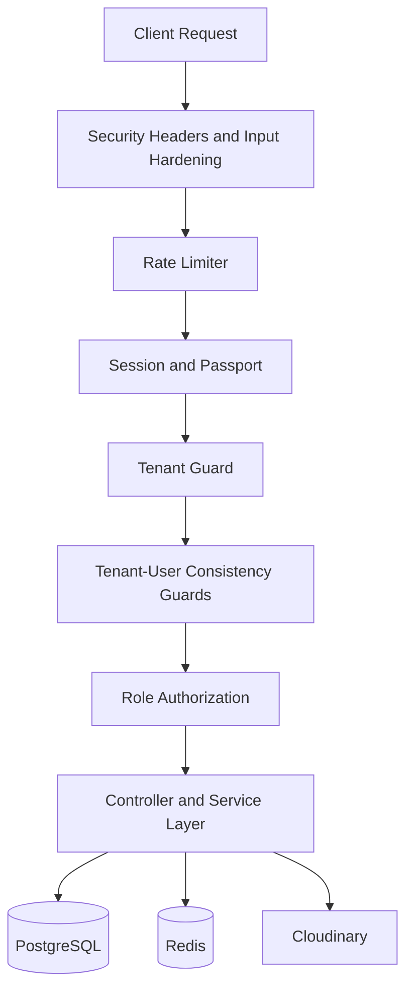

# Multi-Tenant System Architecture

## Table of Contents

1. Technology Stack
2. Multi-Tenant Architecture Model
3. Data Model and Isolation Rules
4. Security and Isolation Layers
5. Authentication and Authorization Flow
6. Middleware Execution Pipeline
7. Session Management
8. Architecture Diagram
9. Scalability Considerations

## Technology Stack

### Backend
- Runtime: Node.js 18+
- Framework: Express.js 4.18
- Database: PostgreSQL 17+
- Query layer: pg (parameterized SQL)
- Authentication: JWT and Passport.js
- Session persistence: express-session with PostgreSQL store

### Frontend
- Vanilla JavaScript (ES6+)
- Bootstrap 5
- Tenant-specific static assets served by domain context

### Infrastructure
- Azure App Service
- Azure Database for PostgreSQL
- Redis-compatible cache/session strategy
- Cloudinary for media assets
- GitHub Actions for CI/CD

## Multi-Tenant Architecture Model

RazoConnect uses a shared-database, shared-schema SaaS model with strict row-level tenant segmentation.

Core principles:
- One application instance serves multiple tenants
- Business tables are tenant-scoped through tenant_id
- Tenant context is resolved per request
- Cross-tenant access is blocked by middleware and data-access constraints

Tenant registry table (conceptual):
- tenant_id
- customer_name
- domain
- theme
- is_active
- created_at

## Data Model and Isolation Rules

### Tenant-scoped entities

Business entities include tenant_id and enforce tenant boundaries in read/write paths.
Examples:
- productos
- clientes
- pedidos
- administradores
- cupones

### Shared entities

Global entities without tenant_id exist only for platform-wide concerns.
Examples:
- tenants
- estados
- developers

### Mandatory query rules

1. SELECT statements must include tenant_id filters.
2. INSERT statements must write tenant_id for tenant-scoped tables.
3. UPDATE and DELETE statements must include tenant_id in predicates.
4. JOINs across tenant-scoped tables must preserve tenant boundaries.

## Security and Isolation Layers

### Tenant Guard

tenantGuard middleware resolves tenant context from domain (or FORCE_TENANT_ID in approved development mode), validates tenant status, and injects req.tenant.

Responsibilities:
- Tenant lookup by normalized domain
- Tenant active-state validation
- Safe redirect for suspended or unknown tenant contexts
- Session invalidation on tenant switch

### Authenticated tenant consistency

validateUserTenant and tenantSessionGuard ensure authenticated tenant context matches request tenant context.

Controls:
- Detect tenant mismatch between identity and request domain
- Invalidate session and clear cookies on mismatch
- Block access with unauthorized response

### Static asset isolation

Tenant-specific static content is resolved from tenant theme folders.
This prevents accidental cross-tenant UI context leakage.

## Authentication and Authorization Flow

### Authentication

- Access tokens are validated in authenticate middleware.
- Token blacklist checks are executed against Redis-backed storage.
- User records are validated against active status and tenant scope where applicable.

### Authorization

Role guards enforce operation-level access before reaching controllers.
Examples:
- authorize
- authorizeAdmin
- authorizeAdminOnly
- authorizeAdminOrAgente

## Middleware Execution Pipeline

High-level pipeline:

1. Security headers and request hardening
2. CORS and payload controls
3. Input sanitization and injection pattern checks
4. Global API rate limiting
5. Session middleware
6. Passport initialization
7. Tenant resolution (tenantGuard)
8. Tenant-user consistency checks
9. Static tenant asset routing
10. API route handlers

Design goal:
- No business handler should execute without passing security, identity, tenant, and authorization layers.

## Session Management

Session strategy:
- Session persistence in PostgreSQL for multi-instance resilience
- Domain-aware cookie handling in dynamic session config
- Explicit session destruction on tenant boundary violations

Cookie controls:
- httpOnly cookies
- secure cookies in production
- sameSite policy aligned to environment profile

## Architecture Diagram

## Scalability Considerations

Current strengths:
- Cost-efficient shared infrastructure
- Centralized maintenance and release model
- Tenant isolation controls embedded in middleware and query design

Planned scale controls:
- Table partitioning strategies for high-volume tenant-scoped entities
- Tenant-specific workload isolation for high-traffic cases
- Enhanced observability by tenant and role domain

## Governance Notes

This document is the canonical architecture baseline for multi-tenant controls.
Detailed implementation audits and modernization recommendations are documented in docs/ARCHITECTURE_AUDIT.md.
