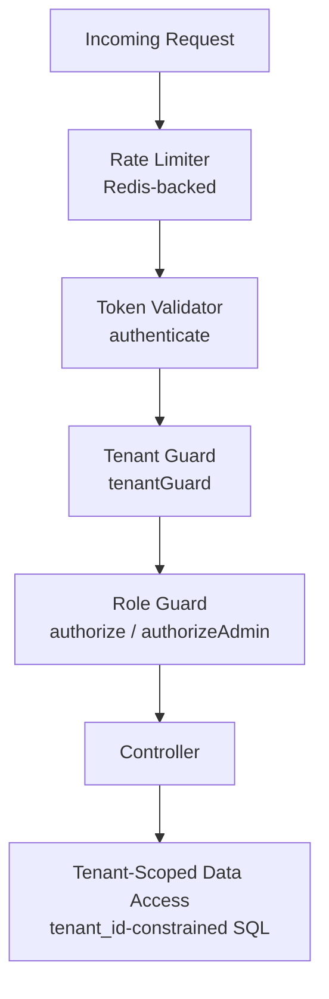

# RazoConnect Security Architecture

## Security Posture and Threat Model

RazoConnect applies a defense-in-depth model across identity, tenant isolation, network controls, request validation, and data access boundaries.

Primary threat classes addressed:

- Unauthorized access to protected business functions
- Cross-tenant data exposure in a shared-schema SaaS model
- Automated abuse and credential stuffing
- Injection and payload-based attacks
- Session misuse and token replay after logout

Security priorities:

- Preserve tenant data boundaries at all application layers
- Enforce authenticated and role-scoped access before business logic execution
- Fail safely on invalid sessions and token anomalies
- Maintain auditable control points in middleware and database access patterns

## Multi-Tenant Isolation

RazoConnect enforces tenant isolation through layered controls in request processing and data access.

Isolation controls:

- Tenant resolution per request via domain mapping in tenantGuard middleware
- Tenant context attached to req.tenant and consumed by downstream middleware/controllers
- Mandatory tenant scoping pattern in SQL operations using tenant_id constraints
- Session invalidation when a tenant context switch is detected
- Explicit tenant mismatch detection between authenticated identity and current request tenant

Implementation controls:

- Domain and tenant resolution: middlewares/tenantGuard.js
- Authenticated tenant consistency checks: middlewares/validateUserTenant.js
- Session guard for cross-tenant mismatch handling: middlewares/tenantSessionGuard.js
- Session persistence and domain-aware cookie policy: middlewares/dynamicSessionConfig.js

Data boundary expectation:

- Every tenant-scoped read/write operation must include tenant_id conditions
- No controller or service should execute tenant-bound queries without tenant context

## Identity and Access Management (IAM)

RazoConnect IAM combines token-based authentication with role-based authorization checks.

Authentication model:

- Bearer JWT access tokens are validated on protected routes
- Token payload includes user identity, role, and tenant binding where applicable
- Token replay protection is implemented through Redis-backed token blacklist checks
- User activity and role are re-validated against persistent records (administradores, clientes, agentesdeventas)

Authorization model:

- Route guards enforce role-based access policies before controller execution
- Administrative and operational guards support role granularity for business domains
- Tenant/role consistency is validated before protected operations continue

Operational role model in current platform:

- super_admin
- admin
- inventarios
- catalogo
- finanzas
- compras
- agente
- cliente

Implementation controls:

- Authentication and role guards: middlewares/authMiddleware.js
- Auth route protection and brute-force controls: routes/auth.js

## Application Security (AppSec)

RazoConnect applies multiple AppSec controls on all API traffic.

### Network and Request-Level Controls

- Redis-backed distributed rate limiting for global, auth, tenant, and heavy-operation scopes
- Proxy-aware client keying for cloud edge environments
- Strict CORS whitelist model for trusted origins
- Payload size limits to reduce oversized request abuse

Implementation references:

- middlewares/rateLimiter.js
- index.js

### Header Hardening and Browser Security Controls

- Content-Security-Policy configured with explicit source directives
- HSTS in production
- X-Frame-Options, X-Content-Type-Options, Referrer-Policy, Permissions-Policy
- Removal of technology disclosure headers

Note:

- Controls are implemented using a custom security middleware stack with Helmet-equivalent policy coverage, including CSP enforcement.

Implementation reference:

- middlewares/securityHeaders.js

### Input Validation and Injection Resistance

- Recursive input sanitization for body, params, and query
- Prototype pollution key stripping
- Structured validators for types, required fields, and length constraints
- SQL injection pattern detection as an additional guard layer
- Parameterized SQL query usage pattern enforced in business code

Implementation references:

- middlewares/inputValidator.js
- middlewares/securityHeaders.js
- controllers and services using parameterized queries through db.query(..., [params])

## Secure Authentication Flow (Middleware Pipeline)

The following flow describes the control chain for protected API requests.

Control objective:

- No protected business handler executes without passing anti-abuse, identity, tenant, and role gates.

## Security Governance Notes

- This document defines implemented security controls at architecture and middleware level.
- Detailed hardening change history is maintained in docs/SECURITY_AUDIT.md.
- Security control reviews should be performed after major authentication, tenancy, or middleware changes.
